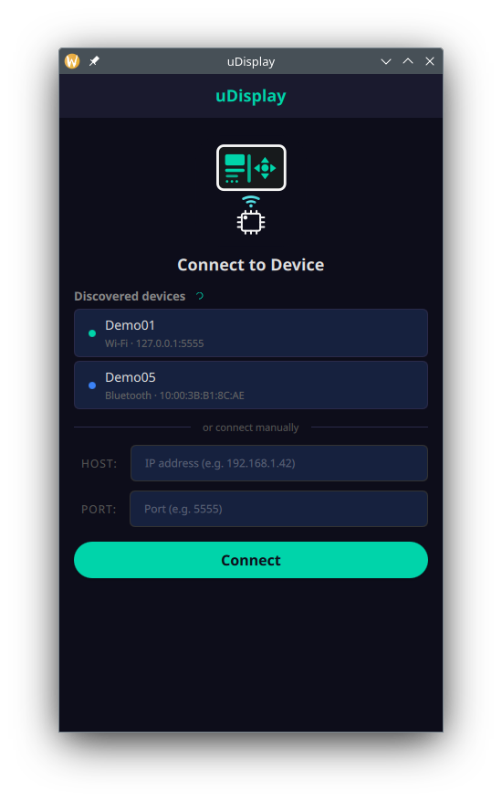
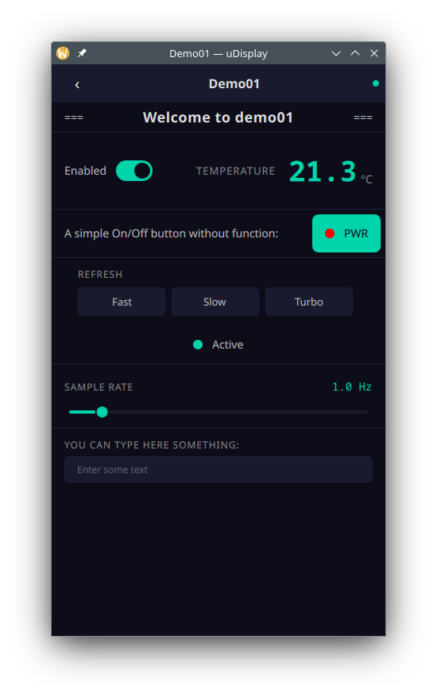
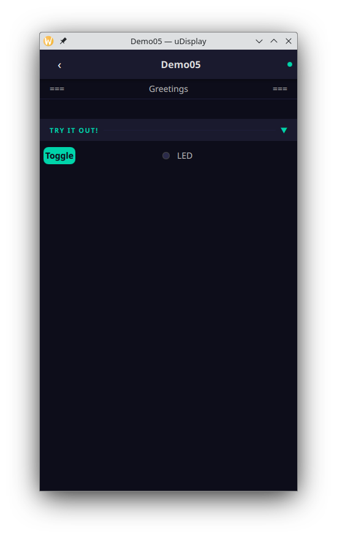

## uDisplay 

### Universal Remote UI for Embedded Devices

**uDisplay** is an open-source framework for building remote user interfaces for microcontroller-based devices.

It allows firmware developers to define a device UI declaratively (using a YAML-based format), and automatically generate the corresponding firmware-side code. A cross-platform client application (desktop and mobile) then renders and interacts with this UI over a direct connection (BLE or TCP), without requiring any cloud infrastructure.

  

## Why uDisplay?

Many embedded projects end up reimplementing the same patterns:

 - custom serial/BLE protocols
 
 - ad-hoc mobile apps or web UIs
 
 - tightly coupled firmware ↔ UI logic

uDisplay aims to standardize this by introducing a **generic, reusable UI layer** between firmware and client.

## Key Ideas
 
 - Declarative UI definition  
   Define your device interface in a structured YAML format instead of hardcoding it.
   
 - Code generation for firmware  
   A Python-based generator produces firmware-side code (Selectable: **C/C++/micropython**) that integrates with a lightweight core library and is easy to use.
   
 - Generic client application  
   A single client app can connect to different devices and render their UI dynamically.

 - Direct communication  
   No cloud required — devices are accessed locally via BLE or TCP.
   
## Use Cases

 - Hobby / DIY electronics projects
 
 - Quick prototyping
 
 - Headless measurement devices
 
 - Custom hardware controllers
 
 - Internal tools where building a full app would be overkill
 
## Project Structure

uDisplay consists of three main parts:

1. Client Application  
A Qt-based app (Desktop, Android; iOS planned) that renders and interacts with device UIs.

2. Core Library (Firmware side)  
A lightweight library embedded into firmware, handling communication and UI state.

3. Code Generator  
A Python tool that converts YAML definitions into firmware-ready code.

## Documentation

- [History](docs/history-roadmap.md) - History/roadmap
- [Quickstart](docs/quickstart.md) — write a device UI, preview it live, generate code, wire it up
- [Building from source](docs/building.md) — all dependencies and build instructions for Ubuntu
- [Protocol](docs/protocol.md) — binary wire format
- [Widget reference](docs/widgets.md) — supported widget types and YAML schema

## Future improvements

1. Extend with MVVM architecture layer, declarative datamodel
2. Implement WebView component in client app to support commercial grade feature rich UI development 
3. IPFS integration for off-firmware blob support (Merkle root based cache already implemented in client)

## License

Copyright (c) 2026 Attila Agas

| Component | License | SPDX |
|-----------|---------|------|
| **libudisplay** | Apache 2.0 | `Apache-2.0` |
| **udisplay-gen** | MPL 2.0 | `MPL-2.0` |
| **generated code** (output of udisplay-gen) | MIT | `MIT` |
| **udisplay-client** | LGPL v3 | `LGPL-3.0-only` |
| **demos** | MIT | `MIT` |

Full license texts are in [`LICENSES/`](LICENSES/).

### udisplay-client distribution note

udisplay-client statically links [QZeroConf](https://github.com/jbagg/QtZeroConf) (LGPL v3).
When distributing Android APKs or other statically linked builds, LGPL v3 requires that
recipients can relink against a modified version of the LGPL components. This is satisfied
by distributing the app's object files or full source alongside the binary.

## Disclosure

This project was developed with the assistance of AI tools (e.g. Claude).
All code is reviewed, tested, and maintained by human author.

## Support & Work

If you find this project useful, consider supporting it via GitHub Sponsors.

I am also available for freelance / contractor work (C++, embedded, Qt, backend).
Feel free to reach out via [LinkedIn](https://www.linkedin.com/in/attila-agas).
